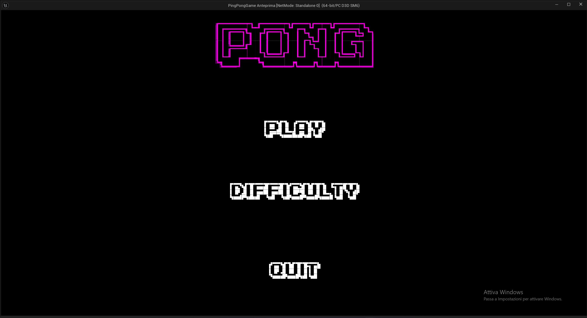
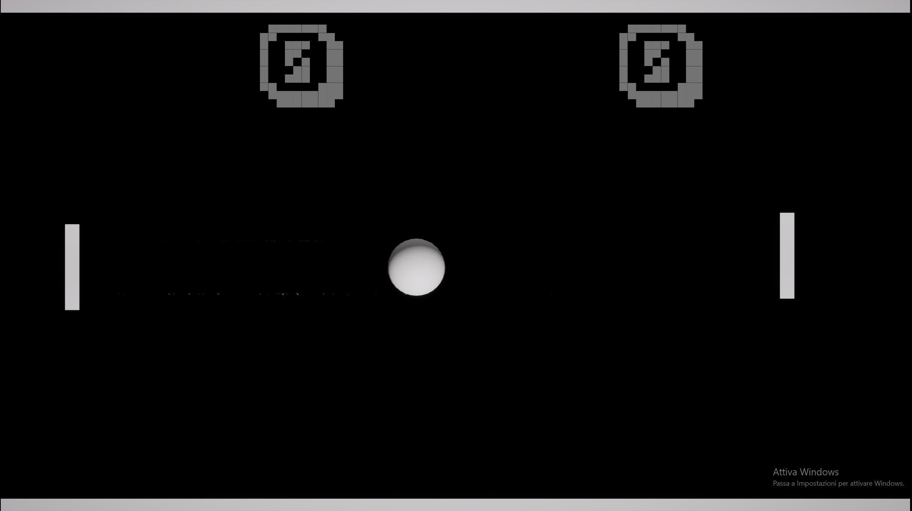
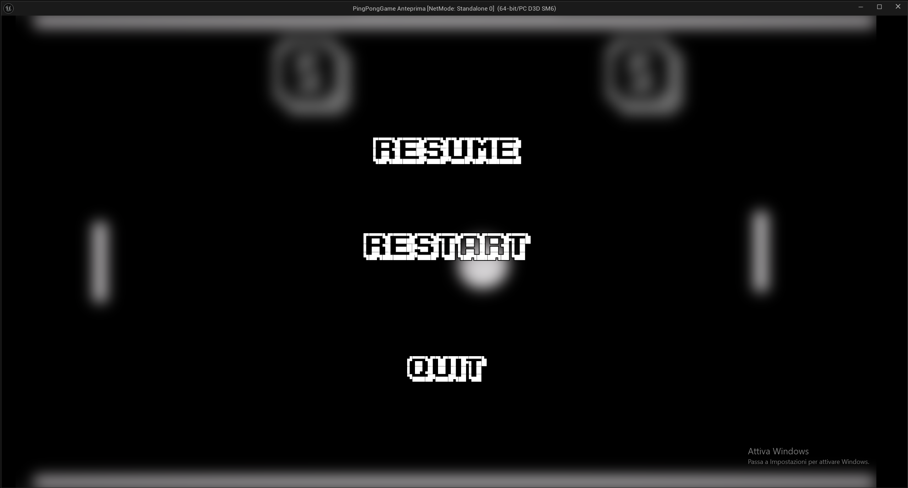

# 🎮 Pong Remake (Unreal Engine 5)

A modern remake of the classic **Pong**, developed in **Unreal Engine 5** as a portfolio and learning project.  
(Un remake moderno del classico **Pong**, sviluppato in **Unreal Engine 5** come progetto di studio e portfolio.)

---

## 🚀 Features
- Main menu with difficulty selection  
  (Menu principale con selezione difficoltà)  
- Pause menu with blurred background  
  (Menu di pausa con sfondo sfocato)  
- 3 AI difficulty levels: Easy / Normal / Hard  
  (3 livelli di difficoltà IA: Easy / Normal / Hard)  
- UI animations (hover & click effects)  
  (Animazioni UI: hover e click)  
- Score system and match handling  
  (Sistema di punteggio e gestione partite)  

---

## 🕹️ Controls
- **Player** → `W` (up) / `S` (down)  
- **Pause** → `L`  

---

## 📸 Screenshots
Example screenshots from the current build:  
(Esempi di schermate dalla build attuale:)  

  
  
  

---

## 🛠️ Tech
- Unreal Engine 5 (Blueprints)  
- GitHub for version control & portfolio  
- UE5 `.gitignore` configured  

---

## 🔮 Future Improvements
- Sound effects & background music  
- Extra game modes  
- Advanced ball VFX  

---

## 📜 License
This project is released under the [MIT License](LICENSE).  
(Questo progetto è rilasciato sotto licenza [MIT](LICENSE).)

---

👤 **Author**: [PierFra](https://github.com/PieroFra)  
📅 **Version**: 1.0  
